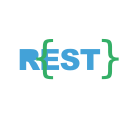
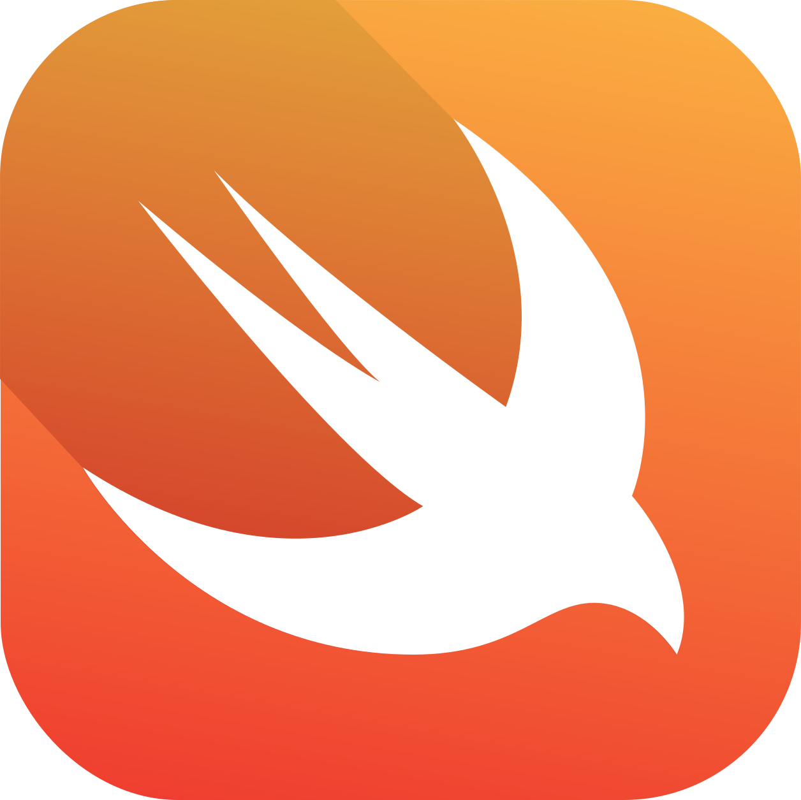
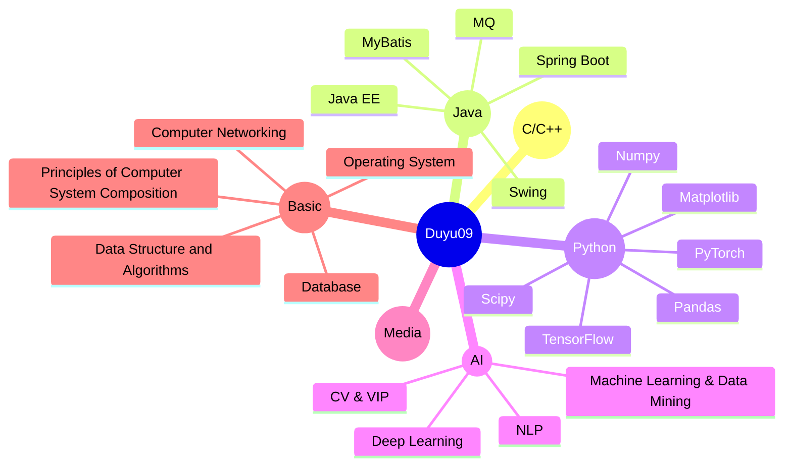

<div style="display:inline-block;" align="center">
   <!-- https://github.com/user-attachments/assets/76a5044f-0fb6-468a-9b92-cb93a06acde0 -->
  <br><br>
</div>

<table>
  <tr>
    <td align="center" width="52%">
      <h2>✨<b>Profile</b>✨</h2>
      <p align="left">
         <b>
          &nbsp;&nbsp;&nbsp;&nbsp; <a href="https://faculty.lzjtu.edu.cn/chenmei/en/xsxx/2570/content/1837.htm" style="font-weight: 900">DU Yu</a> (Chinese Trad.: <i>杜宇</i>; Vietnamese: <i>ĐỖ Vũ</i>) received his Bachelor of Engineering in Software Engineering from the Faculty of Computer Science and Technology, Qilu University of Technology (Shandong Academy of Sciences). He is currently pursuing a master’s degree in Computer Science and Technology at the School of Electronic and Information Engineering, Lanzhou Jiaotong University, under the supervision of <a href="https://faculty.lzjtu.edu.cn/chenmei/en/index/2557/list/index.htm">Prof. CHEN Mei</a> (Chinese Trad.: <i>陳梅</i>; Vietnamese: <i>TRẦN Mai</i>). His research focuses on Time Series Analysis (TSA) / Machine Learning / Data Mining / Natural Language Processing (NLP).
        </b>
        <br><br>
        <b>Emails:</b><br>
        &nbsp;&nbsp;&nbsp;&nbsp;<a href="mailto:qluduyu09@163.com">qluduyu09@163.com</a><br>
        &nbsp;&nbsp;&nbsp;&nbsp;<a href="mailto:qluduyu09@gmail.com">qluduyu09@gmail.com</a><br>
        &nbsp;&nbsp;&nbsp;&nbsp;<a href="mailto:11250717@stu.lzjtu.edu.cn">11250717@stu.lzjtu.edu.cn</a><br>
        &nbsp;&nbsp;&nbsp;&nbsp;<a href="mailto:202103180009@stu.qlu.edu.cn">202103180009@stu.qlu.edu.cn</a>
      </p>
    </td>
    <td align="center" width="50%">
      
    </td>
  </tr>
</table>

<!-- &nbsp;

 -->

<!--  -->

<table>
<tr>
<td>

```json
{
  "name": "杜宇",
  "alias": ["Du Yu", "Đỗ Vũ"],
  "place": ["Jinan, Shandong Prov.", "Lanzhou, Gansu Prov."],
  "role": "Master's Candidate in Computer Sci.&Tech. at LZJTU",
  "advisor": "Professor Chen Mei",
  "education": {
    "MEng.": "Lanzhou Jiaotong University",
    "BEng.": "Qilu University of Technology (SDAS)"
  },
  "research": [
    "Time Series Analysis",
    "Machine Learning",
    "Data Mining",
    "Natural Language Processing"
  ]
}
```

</td>
<td>


</td>
</tr>
</table>

## I. Profile Pages

| **ITEM**               | **WEBSITE**                                                              | **ITEM**               | **WEBSITE**                                     |
|------------------------|--------------------------------------------------------------------------|------------------------|-------------------------------------------------|
| **Personal Website**   | [https://faculty.lzjtu.edu.cn/chenmei](https://faculty.lzjtu.edu.cn/chenmei/zh_CN/xsxx/2554/content/1837.htm)<br>[/zh_CN/xsxx/2554/content/1837.htm](https://faculty.lzjtu.edu.cn/chenmei/zh_CN/xsxx/2554/content/1837.htm) | **Personal Website02** | [https://faculty.lzjtu.edu.cn/chenmei](https://faculty.lzjtu.edu.cn/chenmei/en/xsxx/2554/content/1837.htm)<br>[/en/xsxx/2554/content/1837.htm](https://faculty.lzjtu.edu.cn/chenmei/en/xsxx/2554/content/1837.htm) |
| **Personal Website03** | https://duyu09-49dlcb7.gamma.site                                        | **Personal Website04** | https://sites.google.com/view/duyu09            |
| **GitHub**             | https://github.com/duyu09                                                | **ORCID**              | https://orcid.org/0009-0003-3740-9627           |
| **Gitee**              | https://gitee.com/duyu09                                                 | **BiliBili**           | https://space.bilibili.com/1065298084           |
| **X (Twitter)**        | https://x.com/duyu09                                                     | **HuggingFace**        | https://huggingface.co/Duyu                     |
| **Kaggle**             | https://www.kaggle.com/duyu09                                            | **CSDN**               | https://blog.csdn.net/QLU_Duyu                  |
| **Baidu**              | https://author.baidu.com/home?app_id=1811799145336290                    | **Google Developer**   | https://g.dev/duyu09                            |
| **YouTobe**            | https://www.youtube.com/@Duyu09                                          | **Linkedin**           | https://www.linkedin.com/in/duyu                |
| **Zhihu**              | https://www.zhihu.com/people/duyu09                                      | **Quora**              | https://www.quora.com/profile/Du-Yu-2-1         |
| **Gitcode**            | https://gitcode.com/duyu09                                               | **PyPI**               | https://pypi.org/user/Duyu09                    |
| **CNBlogs**            | https://www.cnblogs.com/duyu09                                           | **OSChina**            | https://my.oschina.net/u/9501904                |
| **Tatoeba**            | https://tatoeba.org/zh-cn/user/profile/Duyu09                            | **Web of Science**     | https://www.webofscience.com/wos/author/record/OYF-6014-2025 |
| **TikTok**             | https://www.tiktok.com/@qluduyu09                                        | **Stack Overflow**     | https://stackoverflow.com/users/25525956/duyu09 |
| **Wikipedia**          | https://zh.wikipedia.org/wiki/User:Duyu09                                | **Baidu Baike**        | https://baike.baidu.com/item/杜宇/66707830      |

## II. Projects Presentation

| ID | NAME (ABBR. IN PARENTHESES) | INTRODUCTION | LINK OF REPOSITORIES |
| ----- | ----- | ----- | ----- |
| 01 | Minh Khỏe Tuệ Y - Design and Implementation of a Health Management and Diagnostic Assistance System Based on LLMs and Multimodal Artificial Intelligence (Minh Khỏe Tuệ Y Smart Healthcare System, **MKTY**) | 明康慧医（MKTY）——基于LLM与多模态人工智能的健康管理与辅助诊疗系统的设计与实现（简称：明康慧医 智慧医疗系统）：利用AI与互联网技术实现智能的医疗【齐鲁工业大学（山东省科学院）优秀毕业设计项目】 | https://github.com/duyu09/MKTY-System |
| 02 | Power Load Classification and Prediction System Based on Deep Learning Algorithms (**PLDA**) | 基于深度学习算法的电力负载分类与预测系统。用于根据住户耗电总功率时序数据，推断出可能运行的常见电器种类并预测未来时间的电力消耗功率。 | https://github.com/duyu09/Powerload-Classification-and-Prediction-System |
| 03 | Intelligent Learning Platform Based on LLM & Regression Analysis Algorithms (**ILP**) | 我的青春不迷茫-基于LLM与回归分析的大学生智能生涯指导与学习大平台，针对解决大学生迷茫问题的多功能一站式网站。 | https://github.com/duyu09/Intelligent-Learning-Platform |
| 04 | Official website of Research Group for Natural Language Processing and Cognitive Computing of Qilu University of Technology (Shandong Academy of Sciences) | 齐鲁工业大学(山东省科学院) 自然语言处理与认知计算研究团队官方网站 （源代码仓库）齐鲁工业大学NLP团队唯一官方网站项目 。| https://github.com/duyu09/QLU-NLP-Laboratory |
| 05 | Lexipolis-9B-Chat LLM v1.0 | 政法智言大模型（**Lexipolis-9B-Chat**）基于清华大学THUDM开源的GLM-4-9B大模型，采用LoRA算法微调；擅长法律咨询、公文撰写、政治理解等政法领域文本生成与处理 | https://github.com/duyu09/Lexipolis-9B-Chat |
| 06 | Duyu Audio Processor Core (**DAPC**) | DuYu音频处理器核心。简单处理音频，诸如：变换采样格式，增益衰减，声道混缩，混响回声效果，调整速度与音调，剪切，混合，添加静音，淡入淡出效果，FFT滤波，3D环绕声音效等。 | https://github.com/duyu09/Duyu-Audio-Processor-Core |
| 07 | SIMS System Software | 基于Java Swing与MySQL的学生信息管理系统，可实现基本的CRUD操作。已有发行版可执行文件，运行前需自己部署MySQL数据库。 | https://github.com/duyu09/SIMS-system-Java |
| 08 | Unified Assignment Submission Platform (**UASP**) | 软件工程(开发)21-1-2班 统一作业提交平台，便于收集作业和统计班内作业提交情况。UASP系统已在2023年上半学期使用。 | https://github.com/duyu09/Unified-Assignment-Submission-Platform |
| 09 | AutoCommand (**AC**) | AutoCommand自动执行助手是一款可以让人们能方便而又快捷地执行电脑上特定的操作的自动化软件。是“无代码编程”的雏形。 | https://github.com/duyu09/AutoCommand |
| 10 | DuyuEncryptor (**DyEnc**) | 一款使用VBA(Visual Basic 6.0)和C++语言开发的文件数据加密软件。集文件加密，文件销毁和其他安全措施于一体的集成数据加密软件系统。 | https://github.com/duyu09/DyEncryptor6.0_Plus |
| 11 | Participate in Development of ChatGLM Optimized For Law Related Content as a researcher at Quan Cheng Laboratory (QCL) of Tsinghua University. | 担任清华大学泉城实验室网络空间安全治理项目组流动科研人员，针对法律内容方面的ChatGLM大模型优化与数据处理。 | _Temporarily closed source due to issues involving laboratory secrets_ |

## III. Table of Some Useful Tools & Technology Stacks

&nbsp;&nbsp;&nbsp;&nbsp;These are some useful tools and techstacks that I used before, It includes various front-end frameworks, various back-end programming languages, and artificial intelligence development frameworks. We should learn more about them.

<table align="center">
  <tr>
     <td align="center" width="96">
      
      <br>Alibaba
     </td>
     <td align="center" width="96">
      
      <br>Ali-Cloud
     </td>
     <td align="center" width="96">
      
      <br>AlpineJS
     </td>
     <td align="center" width="96">
      
      <br>Audition
     </td>
     <td align="center" width="96">
      
      <br>Axios
     </td>
     <td align="center" width="96">
      
      <br>BootStrap
     </td>
     <td align="center" width="96">
      
      <br>C
     </td>
     <td align="center" width="96">
      
      <br>ChatGPT
     </td>
     <td align="center" width="96">
      
      <br>C++
     </td>
</tr>
<tr>
     <td align="center" width="96">
      
      <br>C#
     </td>
     <td align="center" width="96">
      
      <br>CSS
     </td>
     <td align="center" width="96">
      
      <br>D-Ocean
     </td>
     <td align="center" width="96">
      
      <br>Docker
     </td>
     <td align="center" width="96">
      
      <br>Electron
     </td>
     <td align="center" width="96">
      
      <br>FFmpeg
     </td>
     <td align="center" width="96">
      
      <br>Flask
     </td>
     <td align="center" width="96">
      
      <br>Git
     </td>
     <td align="center" width="96">
      
      <br>GitHub
     </td>
</tr>
<tr>
     <td align="center" width="96">
      
      <br>GitLab
     </td>
     <td align="center" width="96">
      
      <br>GoLang
     </td>
     <td align="center" width="96">
      
      <br>GraphQL
     </td>
     <td align="center" width="96">
      
      <br>Hibernate
     </td>
     <td align="center" width="96">
      
      <br>HeroKu
     </td>
     <td align="center" width="96">
      
      <br>HTML
     </td>
     <td align="center" width="96">
      
      <br>Java
     </td>
     <td align="center" width="96">
      
      <br>JQuery
     </td>
     <td align="center" width="96">
      
      <br>JavaScript
     </td>
</tr>
<tr>
     <td align="center" width="96">
      
      <br>Keras
     </td>
     <td align="center" width="96">
      
      <br>Kubernetes
     </td>
     <td align="center" width="96">
      
      <br>Laravel
     </td>
     <td align="center" width="96">
      
      <br>Linux
     </td>
     <td align="center" width="96">
      
      <br>Markdown
     </td>
     <td align="center" width="96">
      
      <br>Matplotlib
     </td>
     <td align="center" width="96">
      
      <br>MongoDB
     </td>
     <td align="center" width="96">
      
      <br>MySQL
     </td>
     <td align="center" width="96">
      
      <br>Nginx
     </td>
</tr>
<tr>
     <td align="center" width="96">
      
      <br>NodeJS
     </td>
     <td align="center" width="96">
      
      <br>NPM
     </td>
     <td align="center" width="96">
      
      <br>Numpy
     </td>
     <td align="center" width="96">
      
      <br>NuxtJS
     </td>
     <td align="center" width="96">
      
      <br>.Net
     </td>
     <td align="center" width="96">
      
      <br>Pandas
     </td>
     <td align="center" width="96">
      
      <br>PhotoShop
     </td>
     <td align="center" width="96">
      
      <br>PHP
     </td>
     <td align="center" width="96">
      
      <br>PgSQL
     </td>
</tr>
<tr>
     <td align="center" width="96">
      
      <br>Postman
     </td>
     <td align="center" width="96">
      
      <br>Python
     </td>
     <td align="center" width="96">
      
      <br>PyTorch
     </td>
     <td align="center" width="96">
      
      <br>QT
     </td>
     <td align="center" width="96">
      
      <br>R
     </td>
     <td align="center" width="96">
      
      <br>RabbitMQ
     </td>
     <td align="center" width="96">
      
      <br>React
     </td>
     <td align="center" width="96">
      
      <br>Redis
     </td>
     <td align="center" width="96">
      
      <br>Rest
     </td>
</tr>
<tr>
     <td align="center" width="96">
      
      <br>SK-Learn
     </td>
     <td align="center" width="96">
      
      <br>Scipy
     </td>
     <td align="center" width="96">
      
      <br>Seaborn
     </td>
     <td align="center" width="96">
      
      <br>SpringBoot
     </td>
     <td align="center" width="96">
      
      <br>SpringMVC
     </td>
     <td align="center" width="96">
      
      <br>Swift
     </td>
     <td align="center" width="96">
      
      <br>Tailwind
     </td>
     <td align="center" width="96">
      
      <br>TensorFlow
     </td>
     <td align="center" width="96">
      
      <br>TypeScript
     </td>
</tr>
<tr>
     <td align="center" width="96">
      
      <br>Ubuntu
     </td>
     <td align="center" width="96">
      
      <br>VBA
     </td>
     <td align="center" width="96">
      
      <br>Vite
     </td>
     <td align="center" width="96">
      
      <br>VMware
     </td>
     <td align="center" width="96">
      
      <br>VS
     </td>
     <td align="center" width="96">
      
      <br>VSCode
     </td>
     <td align="center" width="96">
      
      <br>VueJS
     </td>
     <td align="center" width="96">
      
      <br>Webpack
     </td>
     <td align="center" width="96">
      
      <br>Windows
     </td>
</tr>
</table>

<div style="display:inline-block;" align="center">
  


</div>



------

<br>

<br>


<!--  -->

## IV. Favorite Singer

<table>
<tr>
<td>

```text
    Quỳnh Trang (Chinese Trad.: 瓊莊), whose real name is Thân Nguyễn Thùy 
Trang (Chinese Trad.: 申阮翠莊), was born on October 1, 1997, in Tuy Hòa, 
Phú Yên province. She is a prominent young Vietnamese singer known for 
bolero, lyrical, and folk music. Passionate about singing from childhood, 
she often performed folk songs and bolero, and began her professional career 
in 2016 after joining a music competition, where the late artist Phi Nhung—
the overseas bolero queen—discovered her and exceptionally took her as an 
adoptive daughter, bending her usual rules. Under her godmother's devoted 
guidance, Quỳnh Trang quickly established herself with a clear, sweet, and 
emotive voice, paired with a petite and gentle appearance that endears her 
to audiences, earning her the affectionate nickname bolero angel.
```

</td>
<td>

<a href="./images/quynh_trang/quynh.trang.avatar.final.png"></a>

</td>
</tr>
</table>

## V. Visitor Statistics

<a href="https://u8views.com/github/duyu09"></a>

<!---
GitHub HomePage Profile of DuYu (@Duyu09).
Copyright (c) 2021~2025 DuYu (@Duyu09, No.11250717 @ LZJTU; No.202103180009 @ QLU).
---->

