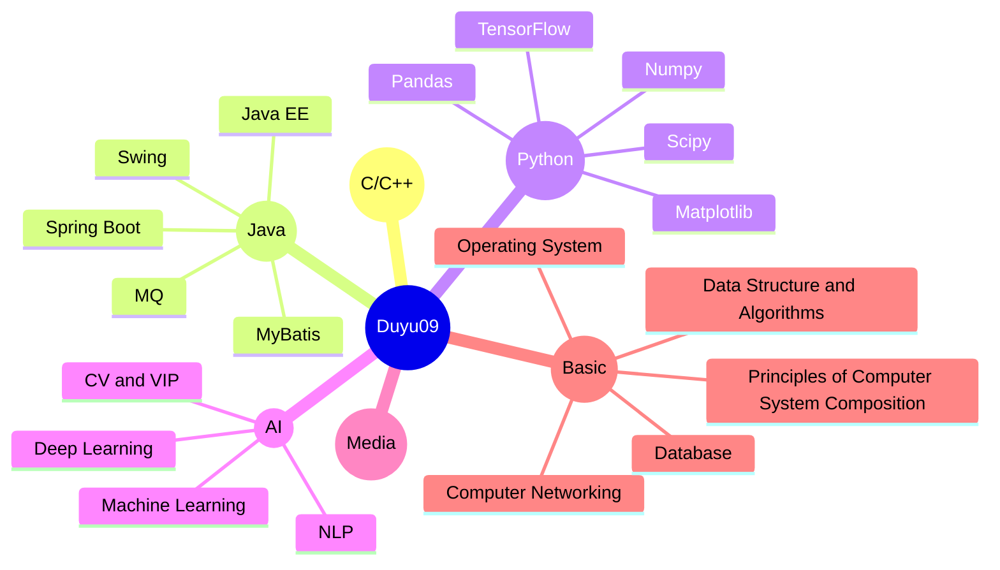

<div style="display:inline-block;" align="center">
  <!--  -->
  
  <br>
  <!--  -->
  
  
  <!--  -->
  
</div>
<br>
<div style="display:inline-block;" align="center">
  


<br>


 


&nbsp;&nbsp;&nbsp;&nbsp;
<!--  -->

<br>

**My Home Page:** &nbsp; https://sites.google.com/view/duyu09 <br> 
**My Baidu Blog:** &nbsp; https://author.baidu.com/home/1756639575860079 <br>
**My CSDN Blog:** &nbsp; https://blog.csdn.net/QLU_Duyu <br>
Welcome to visit my blogs, We can talk about information technology there! <br><br>
<div><b>Number of Total Visits (All of Duyu09's GitHub Projects): </b><br></div> 
<br>
<!-- <div>Number of Total Followers: &nbsp; </div>  --> 
<div><b>Number of Total Visits (Duyu09's GitHub HomePage): </b><br></div> 

</div>
<br><br>
<div style="display:inline-block;" align="center">
  <h1>01. Table of Some Useful Tools & Technology Stacks</h1>
</div>
<br>
<table align="center">
  <tr>
     <td align="center" width="96">
      
      <br>Alibaba
     </td>
     <td align="center" width="96">
      
      <br>Ali-Cloud
     </td>
     <td align="center" width="96">
      
      <br>AlpineJS
     </td>
     <td align="center" width="96">
      
      <br>Audition
     </td>
     <td align="center" width="96">
      
      <br>Axios
     </td>
     <td align="center" width="96">
      
      <br>BootStrap
     </td>
     <td align="center" width="96">
      
      <br>C
     </td>
     <td align="center" width="96">
      
      <br>ChatGPT
     </td>
     <td align="center" width="96">
      
      <br>C++
     </td>
</tr>
<tr>
     <td align="center" width="96">
      
      <br>C#
     </td>
     <td align="center" width="96">
      
      <br>CSS
     </td>
     <td align="center" width="96">
      
      <br>D-Ocean
     </td>
     <td align="center" width="96">
      
      <br>Docker
     </td>
     <td align="center" width="96">
      
      <br>Electron
     </td>
     <td align="center" width="96">
      
      <br>FFmpeg
     </td>
     <td align="center" width="96">
      
      <br>Flask
     </td>
     <td align="center" width="96">
      
      <br>Git
     </td>
     <td align="center" width="96">
      
      <br>GitHub
     </td>
</tr>
<tr>
     <td align="center" width="96">
      
      <br>GitLab
     </td>
     <td align="center" width="96">
      
      <br>GoLang
     </td>
     <td align="center" width="96">
      
      <br>GraphQL
     </td>
     <td align="center" width="96">
      
      <br>Hibernate
     </td>
     <td align="center" width="96">
      
      <br>HeroKu
     </td>
     <td align="center" width="96">
      
      <br>HTML
     </td>
     <td align="center" width="96">
      
      <br>Java
     </td>
     <td align="center" width="96">
      
      <br>JQuery
     </td>
     <td align="center" width="96">
      
      <br>JavaScript
     </td>
</tr>
<tr>
     <td align="center" width="96">
      
      <br>Keras
     </td>
     <td align="center" width="96">
      
      <br>Kubernetes
     </td>
     <td align="center" width="96">
      
      <br>Laravel
     </td>
     <td align="center" width="96">
      
      <br>Linux
     </td>
     <td align="center" width="96">
      
      <br>Markdown
     </td>
     <td align="center" width="96">
      
      <br>Matplotlib
     </td>
     <td align="center" width="96">
      
      <br>MongoDB
     </td>
     <td align="center" width="96">
      
      <br>MySQL
     </td>
     <td align="center" width="96">
      
      <br>Nginx
     </td>
</tr>
<tr>
     <td align="center" width="96">
      
      <br>NodeJS
     </td>
     <td align="center" width="96">
      
      <br>NPM
     </td>
     <td align="center" width="96">
      
      <br>Numpy
     </td>
     <td align="center" width="96">
      
      <br>NuxtJS
     </td>
     <td align="center" width="96">
      
      <br>.Net
     </td>
     <td align="center" width="96">
      
      <br>Pandas
     </td>
     <td align="center" width="96">
      
      <br>PhotoShop
     </td>
     <td align="center" width="96">
      
      <br>PHP
     </td>
     <td align="center" width="96">
      
      <br>PgSQL
     </td>
</tr>
<tr>
     <td align="center" width="96">
      
      <br>Postman
     </td>
     <td align="center" width="96">
      
      <br>Python
     </td>
     <td align="center" width="96">
      
      <br>PyTorch
     </td>
     <td align="center" width="96">
      
      <br>QT
     </td>
     <td align="center" width="96">
      
      <br>R
     </td>
     <td align="center" width="96">
      
      <br>RabbitMQ
     </td>
     <td align="center" width="96">
      
      <br>React
     </td>
     <td align="center" width="96">
      
      <br>Redis
     </td>
     <td align="center" width="96">
      
      <br>Rest
     </td>
</tr>
<tr>
     <td align="center" width="96">
      
      <br>SK-Learn
     </td>
     <td align="center" width="96">
      
      <br>Scipy
     </td>
     <td align="center" width="96">
      
      <br>Seaborn
     </td>
     <td align="center" width="96">
      
      <br>SpringBoot
     </td>
     <td align="center" width="96">
      
      <br>SpringMVC
     </td>
     <td align="center" width="96">
      
      <br>Swift
     </td>
     <td align="center" width="96">
      
      <br>Tailwind
     </td>
     <td align="center" width="96">
      
      <br>TensorFlow
     </td>
     <td align="center" width="96">
      
      <br>TypeScript
     </td>
</tr>
<tr>
     <td align="center" width="96">
      
      <br>Ubuntu
     </td>
     <td align="center" width="96">
      
      <br>VBA
     </td>
     <td align="center" width="96">
      
      <br>Vite
     </td>
     <td align="center" width="96">
      
      <br>VMware
     </td>
     <td align="center" width="96">
      
      <br>VS
     </td>
     <td align="center" width="96">
      
      <br>VSCode
     </td>
     <td align="center" width="96">
      
      <br>VueJS
     </td>
     <td align="center" width="96">
      
      <br>Webpack
     </td>
     <td align="center" width="96">
      
      <br>Windows
     </td>
</tr>
</table>

These are some useful tools and techstacks that I used before, It includes various front-end frameworks, various back-end programming languages, and artificial intelligence development frameworks. We should learn more about them.

<div style="display:inline-block;" align="center">
  
</div>
<br>



<br><br>

<div style="display:inline-block;" align="center">
 <h1>02. Projects Presentation</h1>
</div>

| ID | NAME | INTRODUCTION | LINK OF REPOSITORIES |
| ----- | ----- | ----- | ----- |
| 01 | Intelligent Learning Platform Based on LLM & Regression Analysis Algorithms. | 我的青春不迷茫-基于LLM与回归分析的大学生智能生涯指导与学习大平台，针对解决大学生迷茫问题的多功能一站式网站。 | https://github.com/duyu09/Intelligent-Learning-Platform |
| 02 | Official website of Research Group for Natural Language Processing and Cognitive Computing of Qilu University of Technology (Shandong Academy of Science) | 齐鲁工业大学(山东省科学院) 自然语言处理与认知计算研究团队官方网站 （源代码仓库）。齐鲁工业大学NLP团队唯一官方网站项目 。| https://github.com/duyu09/QLU-NLP-Laboratory |
| 03 | Power Load Decomposition Algorithms | 基于人工智能与Keras框架的电力负荷分解算法。用于从住户耗电总功率时序数据中，推断出可能运行的常见电器及运行功率。 | https://github.com/duyu09/Power-Load-Decomposition-Algorithm |
| 04 | DAPC | Duyu Audio Processor Core，简单处理音频，诸如：变换采样格式，增益衰减，声道混缩，混响回声效果，调整速度与音调，剪切，混合，添加静音，淡入淡出效果，FFT滤波，3D环绕声音效等。 | https://github.com/duyu09/Duyu-Audio-Processor-Core |
| 05 | SIMS System Software | 基于Java Swing与MySQL的学生信息管理系统，可实现基本的CRUD操作。已有发行版可执行文件，运行前需自己部署MySQL数据库。 | https://github.com/duyu09/SIMS-system-Java |
| 06 | Unified Assignment Submission Platform (UASP) | 软件工程(开发)21-1-2班 统一作业提交平台，便于收集作业和统计班内作业提交情况。UASP系统已在2023年上半学期使用。 | https://github.com/duyu09/Unified-Assignment-Submission-Platform |
| 07 | AutoCommand | AutoCommand自动执行助手是一款可以让人们能方便而又快捷地执行电脑上特定的操作的自动化软件。 | https://github.com/duyu09/AutoCommand |
| 08 | DuyuEncryptor | 一款使用VBA(Visual Basic 6.0)和C语言/C++开发的文件数据加密软件。集文件加密，文件销毁和其他安全措施于一体的加密软件。 | https://github.com/duyu09/DyEncryptor6.0_Plus |

<br>
<div style="display:inline-block;" align="center">
 <h1>03. Required For Audio Processing Experiments</h1>
</div>

| Experiments | _The Dull Ice Flower_ _(Lu Bing Hua)_ &nbsp; (Chorus) |
| ----- | ----- |
|  | - __NAME__：The Dull Ice Flower (Lu Bing Hua) <br> - __Author__: Timi Zhuo (Zhuo Yiting) <br> - __Album__: Film and Television Golden Grand Hits 01 <br> - __Release Year__: 1998 |

| 01.Original | 02.High | 03.Low |
|-----|-----|-----|
| <video src="https://github.com/duyu09/Duyu09/assets/92843163/23789473-1492-4970-8716-305cf3056fde" controls> | <video src="https://user-images.githubusercontent.com/92843163/229979488-c158c450-30ea-4100-8e91-23982c85d7ae.mp4" controls> | <video src="https://github.com/duyu09/Duyu09/assets/92843163/43a61b06-1159-4370-aa91-476dc81519db" controls> |
| **Original Piece of this song**<br><br>- Encode Format: **AAC LC**<br> - Sample Rate: **48000 Hz**<br>- Bit Rate: **326 kbit/s** | <i>This audio has been processed with pitch shifting and speed changing using <b>DAPC</b> software.</i><br><br>- Encode Format: **AAC LC**<br><i>(Effective frequency domain: 0~21000 Hz)</i><br> - Sample Rate: **44100 Hz**<br>- Bit Rate: **323 kbit/s** | <i>This audio has been processed with changing sample rate tag only using <b>DAPC</b> software.</i><br><br>- Encode Format: **AAC LC**<br><i>(Effective frequency domain: 0~17200 Hz)</i><br> - Sample Rate: **48000 Hz**<br>- Bit Rate: **129 kbit/s** |

| 04.120_seconds | 05.HD | 06.SD |
|-----|-----|-----|
| <video src="https://github.com/duyu09/Duyu09/assets/92843163/3a2b37e2-da85-40b3-a865-a23ba07926a2" controls> | You can download at [CORE_100s_HD.flac](https://github.com/duyu09/Music/raw/main/CORE_100s_HD.flac) | <video src="https://github.com/duyu09/Duyu09/assets/92843163/984e6e15-83f9-4e15-99d6-777d7ac46742"> |
| - Extended to 2 minutes, Used <i>WSOLA</i> Algorithm.<br><br>- Encode Format: **AAC** <br><i>(Effective frequency domain: 0~24000 Hz)</i><br>- Sample Rate: **48000 Hz**<br>- Bit Depth: **16 bit** | Using <i>IZOTOPE RX10</i> to repair high frequency.<br><br>- Encode Format: **FLAC**<br><i>(Effective frequency domain: 0~27180 Hz)<i><br>- <i>Sample Rate: **54360 Hz**</i><br>- Bit Depth: **24 bit** | Using <i>IZOTOPE RX10</i> to repair high frequency.<br><br>- Encode Format: **AAC**<br><i>(Effective frequency domain: 0~24000 Hz)<i><br>- <i>Sample Rate: **48000 Hz**</i><br>- Bit Rate: **321 kbit/s** |

<br>

<i><b>The lyrics of this piece of Music</b> (Translated to English)</i>

```
I know the stars sing at midnight
It sings with me on homesick nights
I know the afternoon breeze sings
The cicadas of childhood always sings in chorus with wind
When the hands hold prosperity
The mood becomes barren
I realized everything in the world would backpedal
When youth left diary
Black hair became white
The only thing that hasn't changed is the song
Sing back and forth in my heart
```

<br>
<div style="display:inline-block;" align="center">
 <h1>04. Release New Music</h1>
</div>

### 01. _I Really Wanna Stay At Your House_

| 01 | _I Really Wanna Stay At Your House_ |
| ----- | ----- |
|  | - __NAME__：I Really Wanna Stay At Your House <br> - __Author__: Little Tony (Li Xiaoyu) <br> - __Release Year__: 2023 |

| Audio | Video |
| ----- | ----- |
| <video src="https://github.com/duyu09/Duyu09/assets/92843163/cdd2763c-bf70-4f39-b153-79ca7d27b580"> | <video src="https://github.com/duyu09/Duyu09/assets/92843163/06c8d18a-c00c-4a9b-9549-29e7de54b23a"> |
| **_I Really Wanna Stay At Your House_**<br><br>- Encode Format: **AAC**<br>- Sample Rate: **44100 Hz**<br>- Bit Rate: **132 kbit/s** | **_I Really Wanna Stay At Your House_**<br><br>- Audio Encode Format: **Opus**<br>- Sample Rate: **24000 Hz**<br>- Bit Depth: **32 bit** |

```
Quỳnh Trang, sinh năm 1997.
Quê hương của cô là ở thành phố tuy hòa, tỉnh phú an.
Ít được biết đến là một cô gái tên là Thuy Trang, và khi cô chính thức bước lên con đường nghệ thuật,
bởi vì cái tên phù hợp với một ca sĩ nổi tiếng ở quê hương, cô và mẹ quyết định tìm một cái tên mới.
Sự ra đời tên sân khấu và từ đó, Qu ỳ nh Trang rồi.

====================================================================================================

Quynh Trang, born in 1997, originates from Tuy Hoa city, Phu Yen province.
Little-known as a girl named Thuy Trang, when she officially embarked on her artistic path,
because the name suited a famous singer in her hometown, she and her mother decided to find a new name.
The birth of a stage name happened, and since then, she has been known as Quynh Trang.

```

### 02. _Khuya Nay Anh Đi Rồi_

| 02 | _Khuya Nay Anh Đi Rồi_ |
| ----- | ----- |
|  | - __NAME__：Khuya Nay Anh Đi Rồi (You Leave Tonight) <br> - __Author__: Quỳnh Trang (Quynh Trang) <br> - __Album__: Khói Lam Chiều <br> - __Release Year__: 2020 |

| Audio | Video |
| ----- | ----- |
| <video src="https://github.com/duyu09/Duyu09/assets/92843163/79c7f7c6-328e-433a-94b4-ecefd1b11f0c"> | <video src="https://github.com/duyu09/Duyu09/assets/92843163/44c3a538-d549-4464-993c-766ff84a5d4d"> |
| - Encode Format: **AAC**<br>- Sample Rate: **48000 Hz**<br>- Bit Rate: **328 kbit/s** | - Audio Encode Format: **AAC**<br>- Sample Rate: **22050 Hz**<br>- Bit Depth: **16 bit** |

| Accompaniment | Vocal |
| ----- | ----- |
| <video src="https://github.com/duyu09/Duyu09/assets/92843163/5b46405a-1480-4a1b-87aa-24af6cc3dbe4"> | <video src="https://github.com/duyu09/Duyu09/assets/92843163/e1c160ba-38ce-45c2-bb93-4fbb82898ed7"> |
| - Encode Format: **AAC**<br>- Sample Rate: **48000 Hz**<br>- Bit Rate: **328 kbit/s** | - Encode Format: **AAC**<br>- Sample Rate: **64000 Hz**<br>- Bit Rate: **305 kbit/s**<br>- Power By: **Spleeter** and **RX 10** |

### 03.  _Đón Xuân_

| 03 | _Đón Xuân_ |
| ----- | ----- |
|  | - __NAME__：Đón Xuân (Welcoming Spring) <br> - __Author__: Quỳnh Trang (Quynh Trang) <br> - __Release Year__: 2021 |

| Audio | Video |
| ----- | ----- |
| <video src="https://github.com/duyu09/Duyu09/assets/92843163/e1f264f1-0886-4dab-8e1c-7bf6ed34964d"> | <video src="https://github.com/duyu09/Duyu09/assets/92843163/f7fbec1c-e886-40bc-b0dc-87d415da219e"> |
| - Encode Format: **AAC**<br>- Sample Rate: **48000 Hz**<br>- Bit Rate: **337 kbit/s** | - Encode Format: **AAC**<br>- Sample Rate: **22050 Hz**<br>- Bit Rate: **24 kbit/s** |

| Accompaniment | Vocal |
| ----- | ----- |
| <video src="https://github.com/duyu09/Duyu09/assets/92843163/541f1e7b-97af-438a-ba0d-2a27ce207cb1"> | <video src="https://github.com/duyu09/Duyu09/assets/92843163/6506162b-43ac-45ef-a72f-d4059e9b9a5b"> |
| - Encode Format: **AAC**<br>- Sample Rate: **48000 Hz**<br>- Bit Rate: **332 kbit/s** | - Encode Format: **AAC**<br>- Sample Rate: **48000 Hz**<br>- Bit Rate: **279 kbit/s**<br>- Power By: **Spleeter**, **Au** and **RX 10** |

### 04.  _Qua Cơn Mê_

| 04 | _Qua Cơn Mê_ |
| ----- | ----- |
|  | - __NAME__: Qua Cơn Mê (Through the Mist) <br> - __Author__: Quỳnh Trang (Quynh Trang) <br> - __Release Year__: 2020 |

| Audio | Video |
| ----- | ----- |
| <video src="https://github.com/duyu09/Duyu09/assets/92843163/2cd27664-d147-47ae-9924-931a31fbe547"> | <video src="https://github.com/duyu09/Duyu09/assets/92843163/88e86391-d7ce-477c-9caf-7ec55adbe40d"> |

| Accompaniment | Vocal |
| ----- | ----- |
| <video src="https://github.com/duyu09/Duyu09/assets/92843163/333a96cf-460d-41a3-aec5-6081a7d2b137"> | <video src="https://github.com/duyu09/Duyu09/assets/92843163/4ca7de46-bf70-4bf1-94d7-c2c7da35d485"> |

<div align="center">
  </img>
</div>

<br>
<div align="center" style="text-align:center;">
 <h3>I am a student from Faculty of Computer Science & Technology, <br> Qilu University of Technology (ShanDong Academy of Science).</h3>
 
 <!---  --->
</div>

<!---
GitHub HomePage Profile of DuYu (@Duyu09).
Copyright (c) 2021~2023 DuYu (@Duyu09, No.202103180009), Faculty of Computer Science and Technology, Qilu University of Technology (ShanDong Academy of Science).
---->

